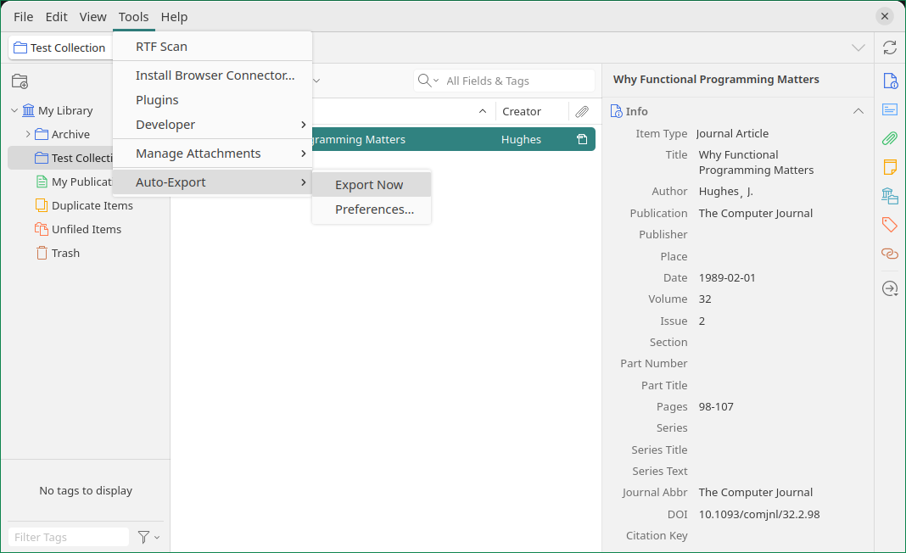
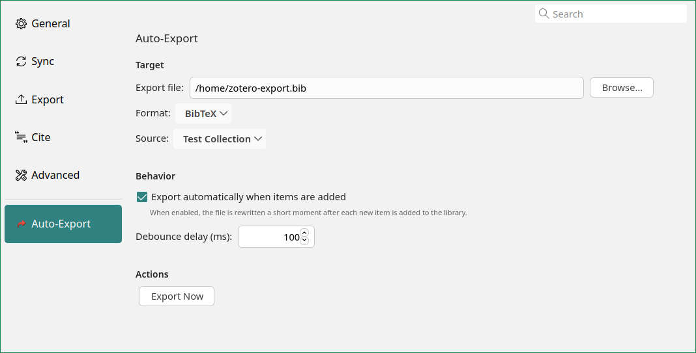
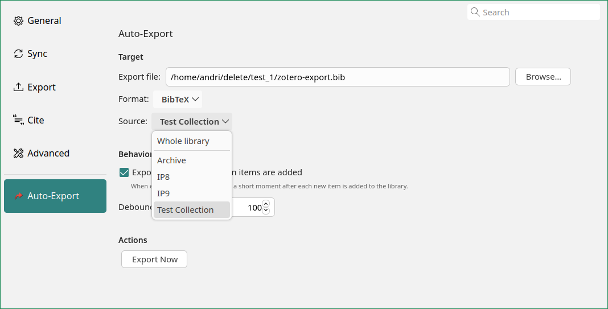
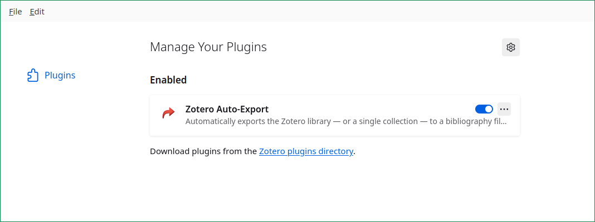

# Zotero Auto-Export

[](https://github.com/andriwild/zotero-bibtex-auto-export/releases/latest)
[](LICENSE)
[](https://www.zotero.org/)

A Zotero 7 plugin that automatically exports your library — or a single collection — to a bibliography file whenever items are added. Keeps your `.bib` file in sync with Zotero without ever clicking **File → Export** again.

Supported formats: **BibTeX** (default), **BibLaTeX**, **RIS**, **CSV**, **EndNote XML**, **CSL JSON**.

## Screenshots

> The screenshots below live under `docs/screenshots/`. Drop the captured `.png` files there with the matching filenames and they'll render automatically.

| Tools menu | Preferences pane |
|---|---|
|  |  |

| Source dropdown (collection picker) | Add-ons list entry |
|---|---|
|  |  |

## Who is this for

Anyone who keeps a `.bib` file (or other bibliography file) in sync with their Zotero library for use in LaTeX, pandoc, or another tool that reads from disk. Instead of re-exporting by hand every time you add a reference, this plugin writes the file for you a couple of seconds after each item is added.

## Requirements

- Zotero 7.0 or newer

## Installation

1. Download the latest `zotero-auto-export.xpi` from the [Releases page](https://github.com/andriwild/zotero-bibtex-auto-export/releases).
2. In Zotero, open **Tools → Add-ons**.
3. Click the gear icon in the top-right of the Add-ons window and choose **Install Add-on From File…**.
4. Select the downloaded `.xpi`. Restart Zotero if prompted.

After installation a new entry **"Auto-Export"** appears in the **Tools** menu.

## Usage

The **Tools → Auto-Export** menu has two quick-access entries:

| Menu entry | What it does |
|---|---|
| **Export Now** | Run an export immediately. On first use (no target file set), the Preferences pane opens so you can pick one. |
| **Preferences…** | Open the Auto-Export pane in Zotero's Preferences dialog. |

All configuration lives in **Edit → Preferences → Auto-Export**:

- **Export file** — pick the target bibliography file via a file-picker dialog.
- **Format** — choose BibTeX, BibLaTeX, RIS, CSV, EndNote XML or CSL JSON. The target file's extension is updated automatically when you change format.
- **Source** — choose which collection to export. Default is **Whole library**; selecting a collection exports that collection and all its subcollections (deduplicated). If the chosen collection is later deleted, the next export falls back to the whole library and shows a warning.
- **Export automatically when items are added** — toggle auto-export on or off (on by default).
- **Debounce delay (ms)** — how long to wait after the last `item add` notification before running the export. Default 2000.
- **Export Now** — same action as the Tools menu entry, for convenience.

### Backups

Before overwriting the target file, the plugin copies the previous version next to it as `<filename>.backup`. Only one backup is kept; it is replaced on each export.

### Debounce delay

Auto-export waits `exportDelay` milliseconds (default: 2000) after each `item add` notification before running, so importing a batch of references only triggers one export at the end.

## Preferences (advanced)

Behind the Preferences pane, settings are stored in Zotero's prefs under the `extensions.auto-export.*` namespace. They can also be edited directly via **Edit → Preferences → Advanced → Config Editor**:

| Preference | Default | Meaning |
|---|---|---|
| `extensions.auto-export.exportPath` | *(unset)* | Absolute path to the bibliography file |
| `extensions.auto-export.exportFormat` | `bibtex` | Format key |
| `extensions.auto-export.translatorID` | BibTeX translator ID | Zotero translator to use |
| `extensions.auto-export.autoExport` | `true` | Whether to export on item-add |
| `extensions.auto-export.exportDelay` | `2000` | Debounce delay in ms |
| `extensions.auto-export.collectionKey` | *(empty)* | Collection key to filter on; empty means whole library |

## Known limitations

- Filtering is limited to one collection (with subcollections). Tag-based or saved-search-based filtering is not implemented.
- Only the first automatic `.backup` file is kept — older versions are overwritten.
- English only — adding a new locale means dropping a `messages.json` into `chrome/locale/<locale>/` (currently only `en-US` is loaded; selection by `Zotero.locale` is not yet wired up).

## License

MIT — see [LICENSE](LICENSE).

---

# Development

The sections below are for contributors working on the plugin itself.

## Project layout

```
manifest.json                       Zotero 7 extension manifest (with icon reference)
bootstrap.js                        Plugin runtime entry; startup/shutdown/onMainWindowLoad/onMainWindowUnload
chrome/content/helpers.js           Pure helpers — dual-loadable by Zotero and Jest
chrome/content/i18n.js              Tiny i18n module — dual-loadable by Zotero and Jest
chrome/content/preferences.xhtml    Preferences pane markup (XUL fragment with inline oncommand handlers)
chrome/content/icon.svg             Plugin icon (Tools menu, Add-ons list, prefs pane header)
chrome/locale/en-US/messages.json   English UI strings (loaded at startup via fetch)
package.json                        Dev harness for Jest — not shipped in the XPI
test/helpers.test.js                Unit tests for the helpers
test/i18n.test.js                   Unit tests for the i18n module
update.json                         Zotero update manifest served from the repo's main branch
.github/workflows/release.yml       Tag-triggered build & release workflow
```

All runtime logic lives as a single object literal `Zotero.AutoExport` in `bootstrap.js`. `startup(data, reason)` does, in order:

1. Loads `helpers.js` and `i18n.js` via `Services.scriptloader.loadSubScript` (using `data.rootURI`, which Zotero 7 provides as a string).
2. `fetch`es `chrome/locale/en-US/messages.json` and passes it to `AutoExportI18n.init()`.
3. Seeds first-run defaults in `Zotero.Prefs` (`exportFormat`, `translatorID`, `autoExport`, `exportDelay`, `collectionKey`) so XUL `preference="..."` bindings show real values instead of empty state.
4. Builds the `Zotero.AutoExport` object with config mirrored from `Zotero.Prefs`, plus all the prefs-pane handlers (`prefsBrowseExportPath`, `prefsFormatChanged`, `prefsCollectionChanged`, `prefsExportNow`, `prefsFormatPopupShowing`, `prefsCollectionPopupShowing`).
5. Registers the preferences pane via `Zotero.PreferencePanes.register({ pluginID, src, label, image })`. **Does not pass a `scripts:` field** — Zotero 7 silently no-ops it. All pane logic runs inside the bootstrap scope via inline XUL `oncommand`/`onpopupshowing` handlers that call `Zotero.AutoExport.prefs*` methods. The returned pane ID is stored in a closure variable so the menu's "Preferences…" item can open it via `Zotero.Utilities.Internal.openPreferences(prefsPaneID)`.
6. Registers the notifier observer.
7. `await`s `Zotero.uiReadyPromise` and installs the Tools menu (Export Now + Preferences…) on every already-open main window.

Windows opened later are handled by the top-level `onMainWindowLoad` / `onMainWindowUnload` hooks that Zotero 7 calls per window.

The notifier handler always calls `refreshConfig()` before reading from `this.config`, because the prefs pane writes to `Zotero.Prefs` directly without notifying the in-memory state.

## Build

There is no build system. The XPI is just a zip of the runtime files:

```sh
zip -r zotero-auto-export.xpi manifest.json bootstrap.js chrome/ LICENSE
```

Important: `package.json`, `node_modules/`, `test/`, `update.json` and `.github/` must not end up inside the XPI — the command above only includes the four paths explicitly, so this is already taken care of.

For debugging, use **Help → Debug Output Logging** in Zotero; the plugin's log lines are prefixed with `[AutoExport]`.

## Tests

Pure logic is extracted into `chrome/content/helpers.js` (string/path/counting) and `chrome/content/i18n.js` (string lookup + placeholder substitution) and unit-tested with Jest. Both files can be tested without starting a Zotero instance.

```sh
npm install                                           # first time only
npm test
npx jest test/helpers.test.js -t replaceExtension     # run a single describe/test
```

Both `helpers.js` and `i18n.js` are **dual-loadable**:

- **In Zotero**: `bootstrap.js` calls `Services.scriptloader.loadSubScript(rootURI + "chrome/content/<file>.js")` at the top of `startup()`. Each file declares its API as a `var` (`AutoExportHelpers`, `AutoExportI18n`), exposing it as a sandbox global in the bootstrap scope.
- **In Node/Jest**: a `module.exports` guard at the bottom of each file exports the same object via CommonJS, so `require('../chrome/content/helpers')` and `require('../chrome/content/i18n')` work from test code.

**Important**: both files must stay free of Zotero APIs, DOM, and XPCOM — otherwise the Node-side tests break. Anything that needs Zotero access stays in `bootstrap.js`.

Currently covered:

- **helpers** — `replaceExtension`, `extensionForTranslatorLabel`, `findFormatKeyByTranslatorID`, `parsePromptIndex`, `countBibEntries`, `buildExportHeader`, `buildCollectionTree` (collection-hierarchy builder used by the prefs pane, covered with 10 cases including flat lists, nested trees, alphabetical sort, orphan nodes, case-insensitive sort and malformed input).
- **i18n** — `init`, `t` (with and without placeholders), `has`, `reset`, fallback for missing keys, repeated and unknown placeholders. Anything that depends on the Zotero runtime (notifier, `Zotero.Translate.Export`, XUL menu, file writes, prefs pane DOM) is **not** unit-testable here — that would require an integration test setup running inside a real Zotero instance.

## Localization

UI strings live in `chrome/locale/<locale>/messages.json` as a flat key→template object. Placeholders use `{name}` syntax (substituted by `AutoExportI18n.t(key, params)`).

Currently only `en-US` is shipped, and `bootstrap.js` always loads `en-US/messages.json` regardless of `Zotero.locale`. To add a new locale:

1. Copy `chrome/locale/en-US/messages.json` to `chrome/locale/<locale>/messages.json` and translate the values.
2. Wire `Zotero.locale` (or `Services.locale.requestedLocale`) into the `fetch()` call in `bootstrap.js`'s `startup()`, with a fallback to `en-US` for unknown locales.

The preferences pane XHTML is currently English-only — i18n is applied via `AutoExportI18n.t()` only for the strings rendered from `bootstrap.js` (menu labels, notifications, `"Whole library"` in the collection dropdown). The static XHTML labels (`"Browse…"`, `"Export Now"`, field labels, section headings) still have `data-i18n` attribute markers but no runtime processing — they stay as whatever is written in `preferences.xhtml`. Localizing them would require a load-time hook inside the preferences window, which Zotero 7's `PreferencePanes.register` doesn't expose.

## Release process

Releases are cut by pushing a `v*` tag. The GitHub Actions workflow in `.github/workflows/release.yml`:

1. Checks out the repo.
2. Verifies that `manifest.json`'s `version` field matches the tag (minus the leading `v`).
3. Builds the XPI with the same `zip` command documented above.
4. Creates a GitHub release with auto-generated release notes and attaches the XPI as an asset.

`update.json` is maintained by hand: before cutting a new tag, bump `manifest.json` `version`, add a new entry to `update.json`'s `updates` array pointing at the download URL of the XPI that the workflow will upload, and only then push the tag.

Zotero 7 clients check `update.json` at the URL configured in `manifest.json` (`applications.zotero.update_url`) and offer updates automatically.

## Conventions

- No ES modules, no `require` inside `bootstrap.js` — the bootstrapped loader evaluates the file as a plain script in Zotero's sandbox global.
- Menu injection uses the Zotero 7 `onMainWindowLoad` / `onMainWindowUnload` hooks; `addMenu(window)` and `removeMenu(window)` both take an explicit window argument so multi-window sessions work correctly.
- Prefer `Zotero.File.pathToFile` + `Zotero.File.putContentsAsync` for file I/O over raw `nsIFile` flows.
- User feedback: `Zotero.ProgressWindow` (`notifyUser()`) for non-blocking toasts; avoid `window.alert` (the main window may not exist when the notifier fires).
- New pure logic belongs in `chrome/content/helpers.js` with matching Jest tests.
